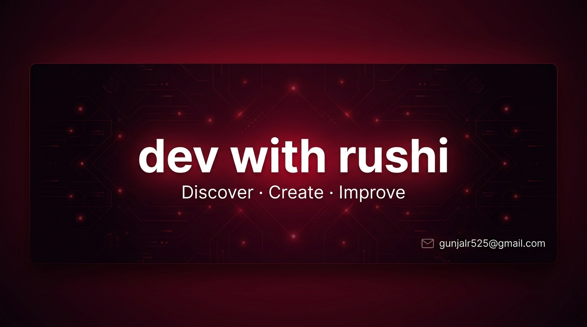

<!-- HEADER BANNER -->

 

<!-- SOCIAL BADGES -->

 

### 👋 Hi there

- 🎓 **AI & Data Science Engineering** student at *Amrutvahini College of Engineering, Sangamner*.
- 💻 **Software Developer** focused on **Full-Stack**.
- ⚙️ Building real-time systems, robust REST APIs, and practical software solutions.
- 🤝 Open to software development opportunities, collaborations, and discussions.

---

### 💻 Tech Stack

  

### 🛠 Tools & Platforms

  

---

### 🚀 Featured Projects

#### 1. [Anonymous Real-Time Chat Application](https://chat-app-ln8m.onrender.com)
> A zero-identity, room-based real-time communication platform featuring procedural client-side audio synthesis and speech processing.

* **Tech:** Node.js, Socket.IO, JavaScript, HTML5 Canvas, Web Audio API, Web Speech API, MediaRecorder API
* **Live Demo:** [chat-app-ln8m.onrender.com](https://chat-app-ln8m.onrender.com)
* **Key Implementations:**
  * Real-time bi-directional messaging with transient Socket.IO rooms.
  * Native **Web Audio API** procedural soundboard (zero external MP3 asset downloads).
  * In-browser voice-note recording with **MediaRecorder** and live **Canvas audio visualizer**.
  * Integrated **Web Speech API** for real-time speech-to-text transcription.

---

#### 2. Reusable JWT Authentication Backend
> A modular, standalone backend authentication system engineered for seamless plug-and-play integration.

* **Tech:** Node.js, Express.js, MongoDB, Mongoose, JWT, bcryptjs, Joi, Nodemailer
* **Key Implementations:**
  * Stateless token-based authorization with secure HTTP-only cookies.
  * Defensive input validation using **Joi** schemas before reaching database layers.
  * Salted cryptographic password hashing with **bcryptjs**.
  * Modular architecture with transactional email workflows via **Nodemailer**.

---

### 📬 Connect With Me

- **Email:** [gunjalr525@gmail.com](mailto:gunjalr525@gmail.com)
- **LinkedIn:** [linkedin.com/in/devwithrushi](https://www.linkedin.com/in/devwithrushi/)
- **GitHub:** [github.com/Rushikesh-Gunjal-525](https://github.com/Rushikesh-Gunjal-525)
